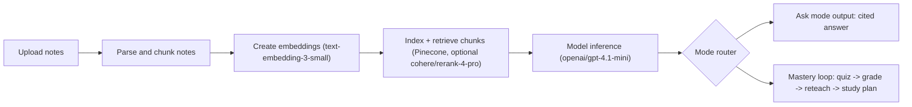

# Study Pal

[](https://opensource.org/licenses/MIT)

Study Pal is a Streamlit app for grounded Q&A over uploaded notes and guided mastery loops.

## Tech Stack

- Language: Python `3.11`
- App UI: Streamlit
- Models: `openai/gpt-4.1-mini` (chat), `text-embedding-3-small` (embeddings)
- Retrieval: Pinecone + optional `cohere/rerank-4-pro` rerank
- Auth: Supabase magic-link
- Storage: Postgres (feedback + per-user encrypted API keys)
- Observability: Langfuse (optional)
- Container: Docker

## Project Docs

- Configuration: [`docs/configuration.md`](docs/configuration.md)
- Auth setup (Supabase): [`docs/auth_setup.md`](docs/auth_setup.md)
- Deployment (local, Docker, Streamlit Cloud): [`docs/deployment.md`](docs/deployment.md)
- Architecture: [`docs/architecture.md`](docs/architecture.md)
- Env safety: [`docs/env-safety.md`](docs/env-safety.md)

## Demo


## System Overview



## Quickstart

### Local

```bash
git clone <your-repo-url>
cd StudyPal
python3.11 -m venv .venv
source .venv/bin/activate
make install
cp .env.example .env
```

Set values in `.env` (minimum):

- `SUPABASE_URL`
- `SUPABASE_PUBLIC_KEY`
- `SUPABASE_REDIRECT_URL=http://localhost:8501`
- `OPENROUTER_KEY_ENCRYPTION_SECRET` (long random value, ex: `openssl rand -hex 32`)
- `DATABASE_URL`
- `PINECONE_API_KEY`
- `PINECONE_HOST`

For the full config list, see [`docs/configuration.md`](docs/configuration.md).

Run:

```bash
make run
```

App runs at `http://localhost:8501`.

### Docker

```bash
make dev
```

## Configuration Notes

- Per-user OpenRouter keys are saved in `Settings` and encrypted at rest.
- Save key validates against OpenRouter before persisting.
- `OPENROUTER_KEY_ENCRYPTION_SECRET` and `DATABASE_URL` are required for key save/delete.
- `SUPABASE_REDIRECT_URL` must match your app URL exactly.
- Restart Streamlit after changing `.env` or `.streamlit/secrets.toml`.

## Development

```bash
make test
make lint
```

## License

MIT
