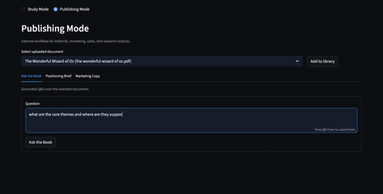
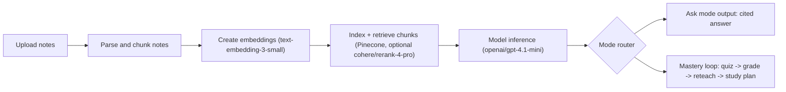

# Study Pal

[](https://opensource.org/licenses/MIT)

Study Pal is a Streamlit app for grounded Q&A over uploaded notes and guided mastery loops.

## Tech Stack

| Area | Technology |
| --- | --- |
| Language | Python `3.11` |
| UI | Streamlit |
| API | FastAPI |
| Models | `openai/gpt-4.1-mini` (chat), `text-embedding-3-small` (embeddings) |
| Retrieval | Pinecone + optional `cohere/rerank-4-pro` rerank |
| Auth | Supabase magic-link |
| Storage | Postgres (feedback + per-user encrypted API keys) |
| Observability | Langfuse, Arize Phoenix, MLflow |
| Container | Docker |

## Project Docs

- Configuration: [`docs/configuration.md`](docs/configuration.md)
- Auth setup (Supabase): [`docs/auth_setup.md`](docs/auth_setup.md)
- Deployment (local, Docker, Streamlit Cloud): [`docs/deployment.md`](docs/deployment.md)
- Architecture: [`docs/architecture.md`](docs/architecture.md)
- Env safety: [`docs/env-safety.md`](docs/env-safety.md)
- Engineering standards: [`docs/engineering-standards.md`](docs/engineering-standards.md)
- API reference: [`docs/api-reference.md`](docs/api-reference.md)
- Observability runbook: [`docs/observability-runbook.md`](docs/observability-runbook.md)
- Evaluation runbook: [`docs/evaluation-runbook.md`](docs/evaluation-runbook.md)

## Demo

### Study Mode


### Publishing Mode



## System Overview


```mermaid
flowchart LR
    A["Upload notes"] --> B["Parse and chunk notes"]
    B --> C["Create embeddings (text-embedding-3-small)"]
    C --> D["Index + retrieve chunks (Pinecone, optional cohere/rerank-4-pro)"]
    D --> E["Model inference (openai/gpt-4.1-mini)"]
    E --> F{"Mode router"}
    F --> G["Ask mode output: cited answer"]
    F --> H["Mastery loop: quiz -> grade -> reteach -> study plan"]
```

## Quickstart

### Local setup

```bash
git clone <your-repo-url>
cd StudyPal
python3.11 -m venv .venv
source .venv/bin/activate
make install
cp .env.example .env
```

Required `.env` values (minimum):

- `SUPABASE_URL`
- `SUPABASE_PUBLIC_KEY`
- `SUPABASE_REDIRECT_URL=http://localhost:8501`
- `OPENROUTER_KEY_ENCRYPTION_SECRET` (long random value, ex: `openssl rand -hex 32`)
- `DATABASE_URL`
- `PINECONE_API_KEY`
- `PINECONE_HOST`

For the full config list, see [`docs/configuration.md`](docs/configuration.md).

### Run app + API

```bash
make run
make api
```

- Streamlit UI: `http://localhost:8501`
- FastAPI base URL: `http://localhost:8000`
- API health: `curl http://localhost:8000/api/health`

## API At A Glance

| Route | Method | Purpose |
| --- | --- | --- |
| `/api/documents/<doc_id>/ask` | `POST` | Document-grounded Q&A |
| `/api/publishing/<doc_id>/book-brief` | `POST` | Generate concise book brief |
| `/api/publishing/<doc_id>/marketing-copy` | `POST` | Generate promotional copy |
| `/api/runs/<run_id>/rate` | `POST` | Save user rating + feedback |
| `/api/documents/<doc_id>/runs` | `GET` | List runs for one document |
| `/api/observability/health` | `GET` | Check observability integrations |

Full request/response examples are in [`docs/api-reference.md`](docs/api-reference.md).

## Observability And Evaluation

### UI review signals (Publishing mode)

Publishing outputs include:

- Grounded in source
- Unsupported claims detected
- Missing context present
- Human review recommended
- Context coverage
- Model, latency, retrieved chunks, relevance scores

### Integrations

| Platform | Current use | Key env vars |
| --- | --- | --- |
| Langfuse | Prompt template versioning, tracing, feedback scoring | `LANGFUSE_PUBLIC_KEY`, `LANGFUSE_SECRET_KEY`, `LANGFUSE_BASE_URL`, `LANGFUSE_PROMPT_VERSION` (optional) |
| Arize Phoenix | Retrieval trace inspection, latency/debug visibility | `PHOENIX_COLLECTOR_ENDPOINT`, `PHOENIX_PROJECT_NAME`, `PHOENIX_API_KEY` (optional, if required by collector) |
| MLflow | Experiment params/metrics/artifacts tracking | `MLFLOW_TRACKING_URI`, `MLFLOW_EXPERIMENT_NAME` |

Detailed outage behavior, timeout defaults, and diagnostics are in [`docs/observability-runbook.md`](docs/observability-runbook.md).

### Retrieval evaluation

- Live metrics: chunk/relevance/coverage + latency/review flags.
- Labeled metrics: `Hit@1`, `Precision@k`, `Recall@k`, `MRR`.

All evaluation commands and labeling workflows are in [`docs/evaluation-runbook.md`](docs/evaluation-runbook.md).

### Future work

- LLM-as-judge claim support coverage / groundedness / faithfulness
- RAGAS-style evaluation
- OCR/vision ingestion for scanned or image-heavy PDFs

## Docker

```bash
make dev
```

## Configuration Notes

- Per-user OpenRouter keys are saved in `Settings` and encrypted at rest.
- Save key validates against OpenRouter before persisting.
- `OPENROUTER_KEY_ENCRYPTION_SECRET` and `DATABASE_URL` are required for key save/delete.
- `SUPABASE_REDIRECT_URL` must match your app URL exactly.
- Restart Streamlit after changing `.env` or `.streamlit/secrets.toml`.

## Development

```bash
make test
make lint
```

## License

MIT
